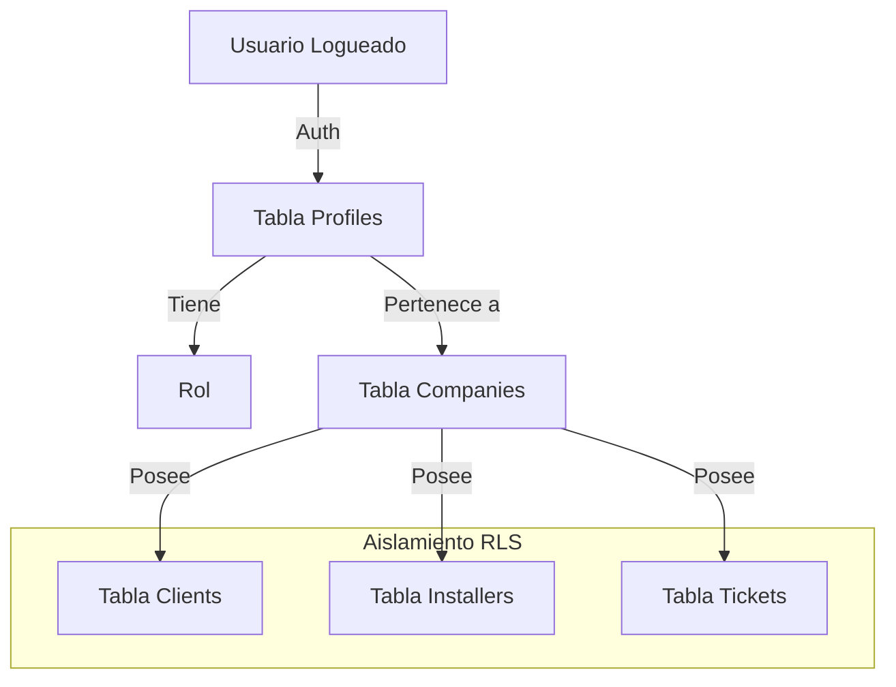

# Arquitectura del Sistema SaaS Multi-Tenant

## Visión General
**dapp-wifi** es una plataforma SaaS (Software as a Service) diseñada para proveedores de servicios de internet (ISPs/WISPs). Permite a múltiples empresas gestionar sus clientes, instalaciones y tickets de soporte de forma aislada y segura.

## Stack Tecnológico
- **Frontend**: Next.js 15 (App Router), React 19, Tailwind CSS.
- **Backend/Base de Datos**: Supabase (PostgreSQL, Auth, Realtime).
- **Pagos**: Paddle (Suscripciones SaaS).
- **Despliegue**: Vercel.

## Modelo Multi-Tenant
La arquitectura utiliza un modelo de **"Database-per-Schema" lógico** (todos los tenants en la misma base de datos, aislados por columna).

### Aislamiento de Datos
Todas las tablas críticas de negocio (`clients`, `installers`, `support_tickets`) tienen una columna `company_id`.
- **`company_id`**: Referencia a la tabla `companies`.
- **Row Level Security (RLS)**: Las políticas de PostgreSQL aseguran que un usuario solo pueda ver/modificar registros donde `company_id` coincida con su empresa asignada en `profiles`.

### Diagrama Lógico de Aislamiento

## Flujo de Autenticación
1. **Login**: Gestionado por Supabase Auth.
2. **Sesión**: Se obtiene el JWT del usuario.
3. **Resolución de Contexto**:
   - Al cargar la app, se consulta la tabla `profiles` para obtener el `company_id` y `role` del usuario.
   - Esta información se usa para filtrar datos en el frontend y validar permisos.

## Estructura de Directorios Clave
- `/app`: Rutas y páginas (Next.js App Router).
- `/components`: Componentes UI reutilizables.
- `/lib`: Utilidades y clientes de Supabase.
- `/supabase`: Migraciones y configuraciones de BD.
- `/types`: Definiciones de TypeScript.
